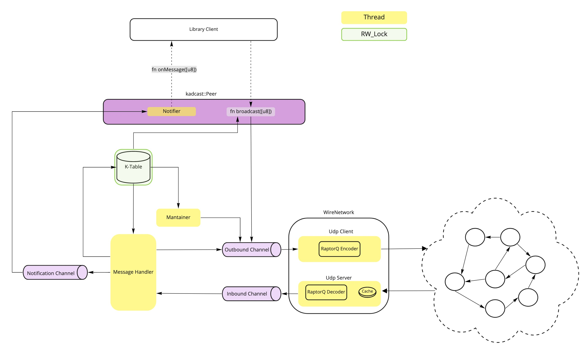

# kadcast
Implementation of the Kadcast Network layer according to [the paper](https://eprint.iacr.org/2021/996.pdf)

## Overlay construction
Kadcast is an UDP-based peer-to-peer protocol in which nodes for a structured overlay. (It can be build agnostigly to the transport protocol used, but we will supose UDP for now.)

All of the nodes have an unique identifier which is generated when they join the network and has a length of `k bits`.

> Dusk kadcast implementation use 128 bits for key length and it's generated taking the first 128bits of Blake2 hash over `<port>`|`<ip_octects>` concatenation. 

This ID determinates the position of the node in a binary routing tree. That's the basics of the Kademlia system.

Nodes mantain the routing state classifiing other nodes in `k-buckets` storing for each node the triplet: `(ip_addr, port, ID)`.

Each bucket is a list of the `K` last recently seen nodes at a certain distance in relation to our node.
> The factor `K`  is a system-wide parameter which determines the routing state and the lookup complexity.

This distance corresponds to the `non-euclidean XOR metric` which represents: `d(x,y) = (x ^ y)`.
And that implies that **each node holds `K` buckets** where on each bucket we can fit the nodes that have a distance `2^i <= d < 2^(i +1)`.

- If a node wants to add anew entry to a given bucket that already holds `k` entries, it employs a least recently used `LRU` drop policy.

- Before dropping an entry from the list, the peer will send a `PING` message to see whether the respective node is still reachable. Only if the node is not reachable anymore, it will be dropped.
> By doing this the protocol favors the old and stable nodes on the network.

###  Bootstraping
This is the process a node has to do in order to join the P2P network.
The main goal is to connect to the `boostrap nodes` and then, retrieve info about the rest of the peers of the network in order to fill our buckets with neighbours.

- When a node first joins the network, it has to know the address of at least one bootstrapping node. It therefore sends `PING` messages to known nodes to check whether they are actually online. Additionally, `PING` transmits the sending node’s routing information to the recipient, thereby distributing its existence in the network.
The bootstrap node will reply with a `PONG` message which also contains it's node info.

### Network discovery.
Starts just after the *boostraping* process. 
The main goal is to fill up the k-buckets with `k` different nodes.
- The process starts by sending a `FIND_NODE` message to the bootstraping nodes that have been added to the k-buckets with the `PONG` messages received.
- Then the *lookup process* starts:
	1) The node looks up the 𝛼 closest nodes regarding the XOR-metric in its own buckets.
	2) It queries this 𝛼 nodes for the ID by sending `FIND_NODE` messages and stores the .
	3) The queried nodes respond with a set of k nodes they belive are the closest to `ID`.
	4) Based on the info adquired information, the node builds a new set of closest nodes and repeats the steps   *1* and *3* repeatedly until it does not get closer nodes than it had on the previous iteration.
>Note that like the bucket size, `𝛼` and `k` are global constants that will determine the redundancy and overhead of the network. The typical values are: `k = [20, 100]` & `𝛼 = 3`.

#### Network manteinance
Each node periodically refreshes every bucket it has not seen some activity from in the last hour: for each such bucket, it picks a random `ID` with appropriate distance and performs a look up to populate its buckets with fresh routing information.

### Block propagation.
For this propagation process, we will use the `CHUNK` messages and the `redundant broadcasting algorithm` purposed on the *Kadcast paper*.
- The algorithm delegates the broadcasting to the sub-trees (buckets). 
- This sub-trees delegate at the same time into  a decreasing heigh `h` sub-tree. 
1) When the broadcast process is initiated, the miner is responsible for the entire height `h = L`.
2) The miner picks `β` random peers from each bucket and delegates the broadcast responsibilities by sending the `CHUNK` messages to them (which carry the data and her routing info).
3) The receiver of the `CHUNK` message assigns a new height `h` which assigns the receiver's broadcast responsibility. So it stores the data of the `CHUNK` message and then it sends it back with the new height value to `k - h` which btw is the the number of buckets where a random peer will be selected to send the `CHUNK` again this time.

### Improving the broadcast Reliability and Performance
- Even the IP protocol grants the best effort datagram, it cannot grant that the network won't have packet losses. And since protocols with CRC codes or RT procedures like `TCP` are slow compared to others without theese kind of properties like `UDP`.
- We also cannot assume that all of the peers play fair and behave correctly on the network.
**In order to avoid the aforementioned problems:**
1) Instead of delegating the broadcast to one peer per bucket, we select `β` delegates.
> This increases the probability of at least one honest node receiving the message.

As each broadcast process is repeated on every hop (decreasing the height), therefore Kadcast nodes ignore duplicate `CHUNK` messages. 
2) Kadcast has to consider transmission failures. Due to that, Kadcast employs *forward error connection schemes* based on [RaptorQ](https://tools.ietf.org/pdf/rfc6330.pdf)
The `FEC` overhead factor can be adjusted through the paramenter `f = (n-s)/s`.
*Need to review RaptorQ paper to get this more clear*.

With the benchmarks it's demonstrated that we can get full network coverage even assuming a 12% packet-loss ratio with a `β = 3` & `f = 0,15`. 
This can be improved or decreased according to our needs.

### Security
This section will be expanded once we get closer to a basic protocol implementation.
ATM, the paper gives solutions for DOS, Sybil and Eclipse attacks and obstruction of block delivery.

## Internal Architecture

